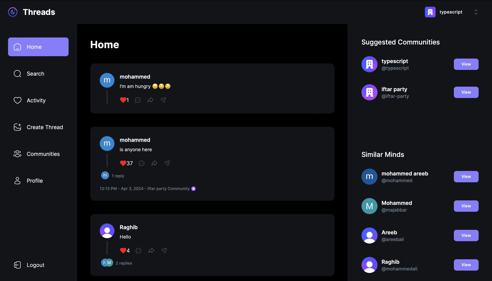

# Threads: A Next.js Community Interaction Platform

  

## Introduction

Threads is a full-stack application built on Next.js 14, offering a sophisticated platform inspired by popular social media interaction models. This project brings a Figma design to life, transforming it into a highly interactive and visually appealing web application. It features an array of functionalities tailored for enhancing community interaction, including user authentication, nested comments, real-time search, notifications, and more. The application is designed to provide a comprehensive toolset for community management, making it an ideal choice for developers looking to explore advanced web development concepts and techniques.

## ⚙️ Tech Stack

- **Next.js**
- **MongoDB**
- **Shadcn UI**
- **TailwindCSS**
- **Clerk**: for robust authentication
- **Webhooks**
- **Serverless APIs**
- **React Hook Form**
- **Zod**: for data validation
- **TypeScript**

## 🔋 Features

- **Authentication**: Secure logins via Clerk with support for email, password, and social logins (Google and GitHub), coupled with detailed profile management.
- **Visually Appealing Home Page**: Engages users with a beautifully designed home page that highlights the latest community threads.
- **Interactive Thread Creation**: Allows users to initiate new discussions within communities.
- **Advanced Commenting System**: Supports nested commenting to ensure a coherent discussion flow.
- **User and Community Search**: Features comprehensive search capabilities with pagination for discovering users and communities.
- **Activity Notifications**: Keeps users engaged with real-time updates when interactions occur on their threads.
- **Community Management**: Tools for creating communities, managing membership, and customizing community settings.
- **Real-Time Updates**: Utilizes webhooks for real-time event listening, enhancing the user experience.
- **Performance and SEO**: Leverages Next.js's server-side rendering for fast performance and better search engine visibility.
- **File Uploads**: Integrated with UploadThing for smooth media handling.

### Like Feature
- **Interactive Like System**: Users can like or unlike threads with a dynamic UI that updates in real-time, reflecting the current state of user interactions.

## 🤸 Quick Start
https://threads-sable-phi.vercel.app
